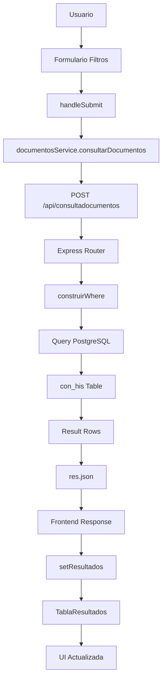
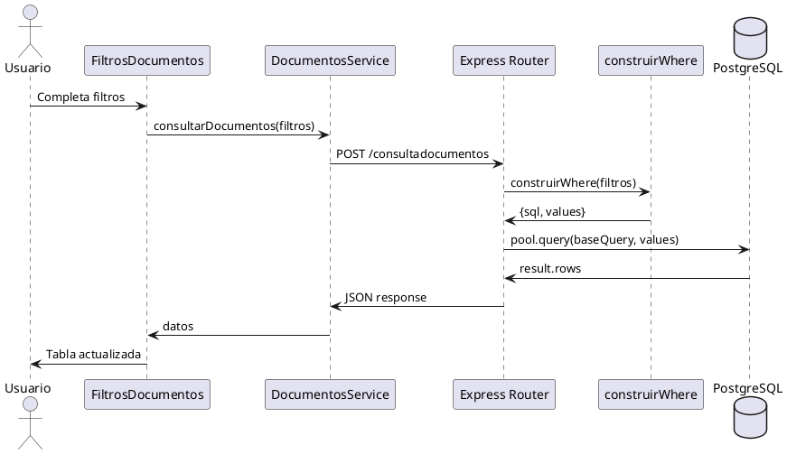

# Código para Diagrama de Flujo NovaWeb

## Mermaid Diagram



## PlantUML Sequence Diagram



## Draw.io / Lucidchart Format

```
FRONTEND                    BACKEND                     DATABASE
┌─────────────────┐        ┌─────────────────┐        ┌─────────────────┐
│ FiltrosDocumentos│        │ Express Router  │        │   PostgreSQL    │
│                 │        │                 │        │                 │
│ 1. handleSubmit │───────▶│ 2. POST /api/   │        │                 │
│                 │        │   consultadoc   │        │                 │
│                 │        │                 │        │                 │
│ 8. setResultados│◀───────│ 7. res.json()   │        │                 │
│                 │        │                 │        │                 │
│ 9. TablaResult  │        │ 3. construirWhere│        │                 │
│                 │        │                 │        │                 │
└─────────────────┘        │ 4. pool.query() │───────▶│ 5. SELECT FROM  │
                           │                 │        │    con_his      │
                           │ 6. result.rows  │◀───────│                 │
                           │                 │        │                 │
                           └─────────────────┘        └─────────────────┘
```

## Flowchart.js Format

```javascript
st=>start: Usuario ingresa filtros
op1=>operation: handleSubmit()
op2=>operation: documentosService.consultarDocumentos()
op3=>operation: POST /api/consultadocumentos
op4=>operation: construirWhere(filtros)
op5=>operation: pool.query(baseQuery, values)
op6=>operation: res.json(result.rows)
op7=>operation: setResultados(datos)
e=>end: UI actualizada

st->op1->op2->op3->op4->op5->op6->op7->e
```

## Visio / Diagram Components

```
┌─────────────────────────────────────────────────────────────────┐
│                        NOVAWEB ARCHITECTURE                     │
├─────────────────────────────────────────────────────────────────┤
│                                                                 │
│  [FRONTEND]              [BACKEND]              [DATABASE]      │
│                                                                 │
│  ┌─────────────┐         ┌─────────────┐        ┌─────────────┐ │
│  │   React     │         │   Node.js   │        │ PostgreSQL  │ │
│  │ Components  │         │   Express   │        │             │ │
│  └─────────────┘         └─────────────┘        └─────────────┘ │
│         │                       │                      │       │
│         │ 1. POST Request        │                      │       │
│         ├──────────────────────▶ │                      │       │
│         │                       │ 2. SQL Query         │       │
│         │                       ├─────────────────────▶│       │
│         │                       │                      │       │
│         │                       │ 3. Result Set        │       │
│         │                       │◀─────────────────────┤       │
│         │ 4. JSON Response       │                      │       │
│         │◀──────────────────────┤                      │       │
│         │                       │                      │       │
│                                                                 │
└─────────────────────────────────────────────────────────────────┘
```

## C4 Model - Context Diagram

```
┌─────────────────────────────────────────────────────────────────┐
│                    NovaWeb System Context                       │
├─────────────────────────────────────────────────────────────────┤
│                                                                 │
│    [Usuario]                                                    │
│        │                                                        │
│        │ Consulta documentos                                    │
│        ▼                                                        │
│  ┌─────────────┐                                                │
│  │   NovaWeb   │                                                │
│  │   System    │                                                │
│  │             │                                                │
│  │ - Frontend  │                                                │
│  │ - Backend   │                                                │
│  │ - Database  │                                                │
│  └─────────────┘                                                │
│                                                                 │
└─────────────────────────────────────────────────────────────────┘
```

## Simple Text Diagram

```
FLUJO DE DATOS NOVAWEB:

1. Usuario → Formulario Filtros
2. Formulario → handleSubmit()
3. handleSubmit → documentosService
4. documentosService → POST /api/consultadocumentos
5. Express Router → construirWhere()
6. construirWhere → SQL dinámico
7. Router → PostgreSQL Query
8. PostgreSQL → Resultados
9. Router → JSON Response
10. Frontend → setResultados()
11. React → Actualiza UI
```

## Swimlane Diagram

```
┌─────────────┬─────────────────┬─────────────────┬─────────────────┐
│   USUARIO   │    FRONTEND     │     BACKEND     │    DATABASE     │
├─────────────┼─────────────────┼─────────────────┼─────────────────┤
│             │                 │                 │                 │
│ Ingresa     │                 │                 │                 │
│ filtros ────┼────────────────▶│                 │                 │
│             │                 │                 │                 │
│             │ handleSubmit()  │                 │                 │
│             │ ────────────────┼────────────────▶│                 │
│             │                 │                 │                 │
│             │                 │ construirWhere()│                 │
│             │                 │ ────────────────┼────────────────▶│
│             │                 │                 │                 │
│             │                 │                 │ SELECT * FROM   │
│             │                 │                 │ con_his WHERE..│
│             │                 │                 │                 │
│             │                 │ result.rows     │                 │
│             │                 │ ◀───────────────┼─────────────────│
│             │                 │                 │                 │
│             │ JSON response   │                 │                 │
│             │ ◀───────────────┼─────────────────│                 │
│             │                 │                 │                 │
│ Ve tabla    │                 │                 │                 │
│ actualizada │                 │                 │                 │
│ ◀───────────┼─────────────────│                 │                 │
│             │                 │                 │                 │
└─────────────┴─────────────────┴─────────────────┴─────────────────┘
```